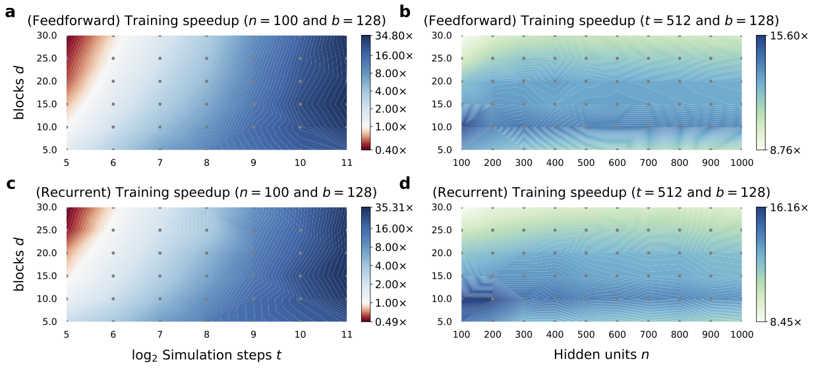
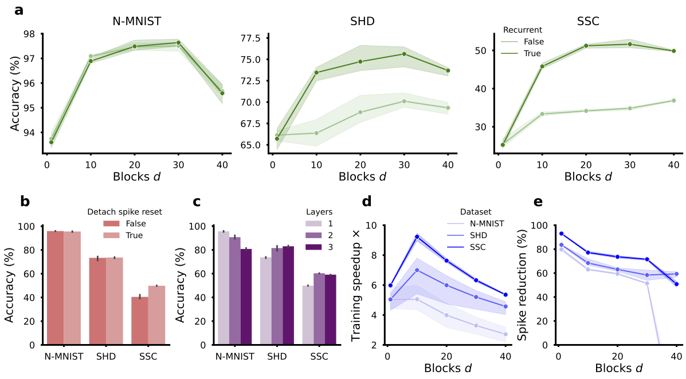

# The d-block model

A new spiking neural network (SNN) model which obtains accelerated training and state-of-the-art performance across various neuromorphic datasets without the need of any regularisation and using less spikes compared to standard SNNs.

## Installing dependencies

Install all required dependencies and activate the dblock environment using conda.
```
conda env create -f environment.yml
conda activate dblock
```

## Getting started tutorial

TODO

## Reproducing paper results

All the paper results can be reproduced using the scripts available in the `scripts` folder. Alternatively, all speedup benchmarks and pretrained models can be found under the releases.

### Running benchmark experiments

The `python run_benchmarks.py` script will benchmark the time of the forward and backward passes of the d-block and standard SNN model for different numbers of neurons and simulation steps.

### Training models

Ensure that the computer has a CUDA capable GPU with CUDA 11.0 installed. 

#### 1. Downloading and processing datasets

Following instructions outlined in the [block repo](https://github.com/webstorms/Block) to download and process the N-MNIST and SHD datasets. The SSC dataset can be [downloaded](https://compneuro.net/posts/2019-spiking-heidelberg-digits/) and unzipped into the `data/SSC` directory

#### 2. Train model

You can train the d-block and standard SNN on the different datasets using the train.py script. For example, to train a d-block model with d=5 on the SHD dataset:
```bash 
python train.py --method=fast_naive --t_len=500 --beta_requires_grad=True --d=5 --recurrent=True --n_layers=1 --n_neurons=128 --detach_recurrent_spikes=True --dataset=shd --epoch=100 --batch=128 --lr=0.001
```

## Building result figures

All speedup and training results can be built by running the `notebooks/results/benchmark_results.ipynb` and `notebooks/results/dataset_results.ipynb` notebooks. The code for the other paper figures can be found under `notebooks/figures` directory.

### Speedup results


Training speedup of our $d$-block model over the standard SNN for feedforward and recurrent networks. **a.** Feedforward network training speedup as a function of the number of blocks $d$ and simulation steps $t$ (for fixed hidden neurons $n=100$ and batch size $b=128$). **b.** Feedforward network training speedup as a function of the number of blocks $d$ and hidden neurons $n$ (for fixed simulation steps $t=512$ and batch size $b=128$). **c.** Same as **a.** but for recurrent networks. **d.** Same as **b.** but for recurrent networks.

### Dataset results


Analysis of our $d$-block model on challenging neuromorphic datasets. We use a single recurrently connected hidden layer network of $128$ neurons and report results for three repeat runs of the model for which the mean and s.d. are plotted. **a.** Accuracy as a function of the number of blocks $d$ using feedforward and recurrent connectivity. **b.** Accuracy with the spike reset being attached or detached from the computational graph during training. **c.** Accuracy as a function of an increasing number of hidden layers. **d.** Training speedup of our model vs the standard SNN as a function of the number of blocks $d$. **e.** Reduction in spikes during inference of our model vs the standard SNN as a function of blocks $d$.